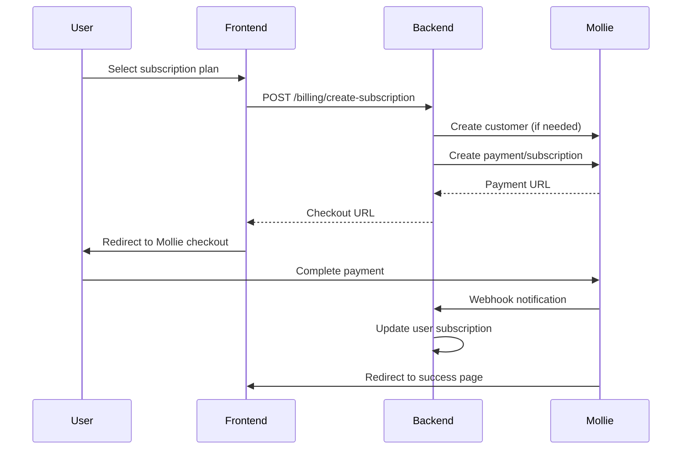

# MiniHabits Mollie Payment Integration

This document provides a complete overview of the Mollie payment integration implemented for the MiniHabits application.

## 🎯 Overview

The integration provides a complete subscription billing system with:
- **4 Subscription Tiers**: Free, Monthly, Yearly, and Lifetime
- **European Payment Methods**: iDEAL, Credit Cards, SEPA, Bancontact, SOFORT
- **Habit Limits**: Enforce subscription-based feature restrictions
- **Webhook Processing**: Real-time payment status updates
- **Clean Architecture**: Separation of concerns with dedicated services

## 🏗️ Architecture

### Backend Structure

```
apps/backend/src/
├── billing/
│   ├── dto/                          # Data Transfer Objects
│   │   ├── create-subscription.dto.ts
│   │   ├── subscription-limits.dto.ts
│   │   └── subscription-plan-info.dto.ts
│   ├── enums/                        # Subscription enums
│   │   ├── subscription-plan.enum.ts
│   │   └── subscription-status.enum.ts
│   ├── interfaces/                   # Configuration interfaces
│   │   └── subscription-config.interface.ts
│   ├── billing.controller.ts         # REST API endpoints
│   ├── billing.service.ts           # Business logic layer
│   └── billing.module.ts            # Module configuration
├── mollie/                          # Pure API integration
│   ├── mollie.service.ts           # Mollie API wrapper
│   └── mollie.module.ts            # Module configuration
└── users/
    └── users.schema.ts             # Updated with subscription fields
```

### Frontend Structure

```
apps/frontend/src/
├── api/
│   ├── types/
│   │   └── billing.ts              # TypeScript types
│   └── hooks/
│       └── useSubscription.ts      # TanStack Query hook
├── components/
│   ├── ui/
│   │   └── badge.tsx              # New UI component
│   └── PricingPlans.tsx           # Subscription plans component
└── pages/
    ├── NewHabit.tsx               # Updated with limit checking
    ├── Pricing.tsx                # Pricing page
    ├── BillingSuccess.tsx         # Payment success page
    └── BillingCancel.tsx          # Payment cancel page
```

## 📊 Subscription Plans

| Plan | Price | Interval | Habit Limit | Features |
|------|-------|----------|-------------|----------|
| **Free** | €0.00 | - | 3 habits | Basic tracking, Simple stats |
| **Monthly** | €1.99 | 1 month | Unlimited | All features, Priority support |
| **Yearly** | €7.99 | 1 year | Unlimited | All features, 67% savings |
| **Lifetime** | €17.99 | One-time | Unlimited | All features, Lifetime updates |

## 🔧 Implementation Details

### 1. Backend Services

#### MollieService (Pure API Layer)
```typescript
@Injectable()
export class MollieService {
  // Pure API methods - no business logic
  async createCustomer(params: any): Promise<Customer>
  async createPayment(params: any): Promise<Payment>
  async createSubscription(customerId: string, params: any): Promise<Subscription>
  async cancelSubscription(customerId: string, subscriptionId: string): Promise<Subscription>
  async getPayment(paymentId: string): Promise<Payment>
  // ... other API methods
}
```

#### BillingService (Business Logic Layer)
```typescript
@Injectable()
export class BillingService {
  // Business logic methods
  async getSubscriptionPlans(): Promise<SubscriptionPlanInfoDto[]>
  async getSubscriptionLimits(userId: string): Promise<SubscriptionLimitsDto>
  async canCreateHabit(userId: string): Promise<boolean>
  async createSubscription(userId: string, dto: CreateSubscriptionDto): Promise<CreateSubscriptionResponseDto>
  async cancelSubscription(userId: string): Promise<{ message: string }>
  async processWebhook(paymentId: string): Promise<void>
}
```

### 2. API Endpoints

#### Protected Endpoints (Require Authentication)
- `GET /billing/plans` - Get subscription plans
- `GET /billing/limits` - Get user's subscription limits
- `POST /billing/create-subscription` - Create new subscription
- `DELETE /billing/cancel-subscription` - Cancel subscription

#### Public Endpoints
- `POST /billing/webhook` - Handle Mollie webhooks

### 3. Database Schema Updates

```typescript
@Schema()
export class User {
  // ... existing fields
  
  // Subscription fields
  @Prop({ type: String, enum: Object.values(SubscriptionPlan), default: SubscriptionPlan.FREE })
  subscriptionPlan: SubscriptionPlan;
  
  @Prop({ type: String, enum: Object.values(SubscriptionStatus), default: SubscriptionStatus.ACTIVE })
  subscriptionStatus: SubscriptionStatus;
  
  @Prop({ type: String, required: false })
  mollieCustomerId?: string;
  
  @Prop({ type: String, required: false })
  mollieSubscriptionId?: string;
  
  @Prop({ type: String, required: false })
  molliePaymentId?: string;
  
  @Prop({ type: Date, required: false })
  subscriptionStartDate?: Date;
  
  @Prop({ type: Date, required: false })
  subscriptionEndDate?: Date;
  
  @Prop({ type: Date, required: false })
  subscriptionCancelledAt?: Date;
}
```

### 4. Frontend Integration

#### useSubscription Hook
```typescript
export function useSubscription() {
  return {
    // Data
    plans: SubscriptionPlanInfo[],
    limits: SubscriptionLimits,
    currentPlan: SubscriptionPlan,
    canCreateHabits: boolean,
    
    // Actions
    createSubscription: (plan: SubscriptionPlan) => Promise<void>,
    cancelSubscription: () => Promise<void>,
    
    // Loading states
    isLoadingPlans: boolean,
    isCreatingSubscription: boolean,
    
    // Helpers
    getYearlySavings: () => number,
  };
}
```

#### Habit Creation with Limits
```typescript
// In NewHabit component
const { canCreateHabits, habitLimit, currentHabits } = useSubscription();

const handleSubmit = async (e: React.FormEvent) => {
  if (!canCreateHabits) {
    toast({
      title: "Habit limit reached",
      description: `You've reached your limit of ${habitLimit} habits.`,
      variant: "destructive",
    });
    return;
  }
  
  // Proceed with habit creation
};
```

## 🔄 Payment Flow

### 1. Subscription Creation Flow


### 2. Webhook Processing
```typescript
async processWebhook(paymentId: string): Promise<void> {
  const payment = await this.mollieService.getPayment(paymentId);
  const metadata = payment.metadata as any;
  
  if (payment.status === 'paid') {
    // Activate subscription
    await this.userModel.findByIdAndUpdate(metadata.userId, {
      subscriptionPlan: metadata.plan,
      subscriptionStatus: SubscriptionStatus.ACTIVE,
      subscriptionStartDate: new Date(),
      // ... calculate end date for recurring plans
    });
  } else if (['failed', 'expired', 'canceled'].includes(payment.status)) {
    // Handle failed payment
    await this.userModel.findByIdAndUpdate(metadata.userId, {
      subscriptionStatus: SubscriptionStatus.EXPIRED,
    });
  }
}
```

## 🔒 Security Considerations

### 1. Environment Variables
```bash
# Required environment variables
MOLLIE_API_KEY=test_dHar4XY7LxsDOtmnkVtjNVWXLSlXsM  # Test key
FRONTEND_URL=https://minihabits.app
WEBHOOK_URL=https://api.minihabits.app/billing/webhook
```

### 2. Webhook Security
- Webhook endpoint is public but processes only valid payment IDs
- All payment metadata is validated before processing
- User ID is stored in payment metadata for verification
- Comprehensive error handling and logging

### 3. Data Protection
- API keys stored securely in environment variables
- No sensitive payment data stored in database
- User subscription data is encrypted in transit
- GDPR-compliant data handling

## 🧪 Testing

### 1. Test Payment Details
```typescript
// iDEAL Test Bank
// Select any test bank and choose "Success" status

// Credit Card Test
const testCard = {
  number: '4242 4242 4242 4242',
  expiry: '12/25',
  cvc: '123'
};
```

### 2. Test Scenarios
1. **Successful Payment**: Complete payment flow and verify subscription activation
2. **Failed Payment**: Cancel payment and verify status remains unchanged
3. **Webhook Processing**: Test webhook events with ngrok
4. **Habit Limits**: Test limit enforcement for free users
5. **Subscription Cancellation**: Test cancellation flow

### 3. Development Setup
```bash
# Backend
cd apps/backend
npm install @mollie/api-client --legacy-peer-deps
npm run dev

# Frontend
cd apps/frontend
npm run dev

# Webhook testing with ngrok
ngrok http 3001
# Update WEBHOOK_URL in .env to ngrok URL
```

## 📱 User Experience

### 1. Pricing Page
- Clean, responsive design with 4 subscription tiers
- "Most Popular" badge on Monthly plan
- Savings calculation for Yearly plan
- Clear feature comparison
- One-click upgrade flow

### 2. Habit Creation Limits
- Real-time limit checking before habit creation
- Visual indicators showing current usage (2/3 habits)
- Upgrade prompts when limits are reached
- Seamless upgrade flow from limit warnings

### 3. Payment Success/Failure
- Dedicated success page with next steps
- Cancel page with alternative options
- Toast notifications for payment status
- Automatic subscription data refresh

## 🚀 Deployment

### 1. Environment Setup
```bash
# Production environment variables
MOLLIE_API_KEY=live_xxxxxxxxxxxxxxxxxxxxx
FRONTEND_URL=https://minihabits.app
WEBHOOK_URL=https://api.minihabits.app/billing/webhook
MONGODB_URI=mongodb+srv://...
```

### 2. Mollie Dashboard Configuration
1. Add webhook URL: `https://api.minihabits.app/billing/webhook`
2. Enable payment methods: iDEAL, Credit Card, SEPA
3. Configure redirect URLs:
   - Success: `https://minihabits.app/billing/success`
   - Cancel: `https://minihabits.app/billing/cancel`

### 3. Monitoring
- Set up logging for all payment events
- Monitor webhook processing success rates
- Track subscription conversion metrics
- Alert on payment failures

## 🔍 Troubleshooting

### Common Issues

**1. Webhook Not Working**
- Verify webhook URL is publicly accessible
- Check Mollie dashboard webhook logs
- Ensure HTTPS is enabled
- Verify webhook returns 200 status

**2. Payment Not Processing**
- Check API key is correct for environment
- Verify payment amounts are in cents
- Check currency is set to EUR
- Review server logs for errors

**3. Subscription Not Activating**
- Verify webhook is processing `payment.paid` events
- Check user ID in payment metadata
- Ensure database updates are successful

### Debug Commands
```bash
# Test webhook endpoint
curl -X POST https://api.minihabits.app/billing/webhook \
  -H "Content-Type: application/json" \
  -d '{"id": "test_payment_id"}'

# Check subscription limits
curl -H "Authorization: Bearer YOUR_JWT_TOKEN" \
  https://api.minihabits.app/billing/limits
```

## 📈 Future Enhancements

1. **Proration**: Handle mid-cycle plan changes
2. **Coupons**: Implement discount codes
3. **Analytics**: Track subscription metrics
4. **Dunning**: Handle failed recurring payments
5. **Invoicing**: Generate PDF invoices
6. **Multi-currency**: Support additional currencies
7. **Family Plans**: Multi-user subscriptions

## 📚 Resources

- [Mollie API Documentation](https://docs.mollie.com/)
- [Mollie Webhooks Guide](https://docs.mollie.com/guides/webhooks)
- [European Payment Methods](https://docs.mollie.com/payments/overview)
- [Subscription Management](https://docs.mollie.com/payments/subscriptions)

---

**Note**: This integration follows European payment regulations and supports the most popular payment methods in Europe. The architecture is designed for scalability and maintainability, with clear separation of concerns between API integration and business logic.